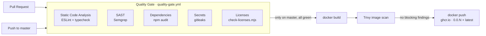

# CI/CD Pipeline

This doc gives an overview of the frontend pipeline and lists decisions that are still open. For what exactly stops the pipeline and what only warns, and the reasons, see [quality-gate.md](quality-gate.md).

## Flow



| Workflow | Trigger | Purpose |
|---|---|---|
| `quality-gate.yml` | Every pull request, manual, or called by `docker-publish.yml` | Runs the five checks in parallel. If any check fails, the gate fails. |
| `docker-publish.yml` | Push to `master`, manual | Runs the gate, then builds the image, scans it with Trivy and pushes it to GHCR. |

The gate is a reusable workflow (`workflow_call`), so PRs and deployments always run the same checks.

**Runtime image:** built in two stages on `node:24-alpine`. The final image contains only `.output/`, runs as the unprivileged `node` user, and has no package managers (npm, npx, corepack, yarn).

## Running the checks locally

```bash
npm run lint          # ESLint (errors = blocking)
npm run typecheck     # vue-tsc
npm run license:check # license policy
npm audit --omit=dev --audit-level=high
```

## Known pitfalls

- **Lockfile generated on Windows:** npm can leave out Linux-only optional dependencies (npm/cli#4828). If CI fails with `npm ci ... Missing: <pkg> from lock file`, regenerate the lockfile in Linux:
  ```bash
  docker run --rm -v "$PWD:/app" -w /app node:24 npm install --package-lock-only --ignore-scripts
  ```
- **Node version** is set in three places: `quality-gate.yml`, the `Dockerfile`, and your local machine. They must stay on the same major version (currently 24). `license-checker-rseidelsohn` requires Node 24 or newer.

## Open decisions

These are not implemented yet. Each one needs a team decision.

### Security and supply chain

1. **Pin versions to hashes.** `semgrep/semgrep` currently runs `latest`, and the GitHub Actions (`@v5`) and the Trivy and gitleaks images use tags that can be moved. Pinning to commit SHAs or image digests protects against a hijacked tag, but you then need Dependabot or Renovate to keep the pins up to date.
2. **Scheduled scans.** New CVEs appear without any change to our code. A weekly `schedule:` trigger on the gate plus a Trivy scan of the `latest` image would catch them. Decide who gets notified.
3. **Automatic dependency updates** (Dependabot or Renovate). Decide on grouping, how often they run, and whether patch updates can be merged automatically once the gate is green.
4. **Exceptions.** Right now nothing can be ignored. Do we allow a `.trivyignore` or Semgrep `nosemgrep` with a required reason and an expiry date? Who approves it?
5. **Registry credentials.** `GHCR_PAT` is one team member's personal token. If that person leaves or the token expires, deployment stops. Options: `GITHUB_TOKEN` with `packages: write`, if the image moves to the same account or an org, or a bot account.
6. **SBOM and signing.** Generate a software bill of materials (Trivy or Syft) and sign images with cosign, so the deployment side can verify where an image came from.
7. **Reporting.** Findings currently only appear in the logs and as annotations. Uploading SARIF to the GitHub Security tab needs a public repo or GitHub Advanced Security. If the repo is public, it's also worth considering CodeQL alongside Semgrep.

### Quality and thresholds

8. **Paying down warnings.** ESLint shows about 250 warnings today. Options:
   - a ratchet: a `--max-warnings` limit that only ever goes down
   - making individual rules blocking once they're cleaned up (good first candidates are `nuxt/prefer-import-meta` and `no-unused-vars`, since both can mostly be fixed with `--fix`)
9. **Tests.** There are no unit or E2E tests yet, so the gate only checks form, not behaviour. The next step would be Vitest plus a few Playwright smoke tests, possibly with a coverage threshold. Decide whether to start blocking on coverage or begin with warnings.
10. **License policy details.** Is MPL-2.0 permanently acceptable? Should LGPL block, since it ends up bundled into the client JS? Who reviews "unknown" licenses such as `only` (`MIT*`)?
11. **Semgrep rulesets.** We currently use `p/javascript`, `p/typescript` and `p/owasp-top-ten`. Options include adding Vue-specific or custom rules for our API calls, or turning some WARNING rules into blocking ones if they rarely give false positives.

### Process and deployment

12. **Branch protection.** Require the gate as a status check on `master` and don't allow direct pushes. Today direct pushes are allowed; the gate still protects the deployment, but nobody reviews the code first.
13. **Versioning.** `0.0.<run_number>` plus `latest` isn't semantic versioning, and `latest` makes rollbacks harder to follow. Options: semver from git tags or conventional commits, or tagging images with the commit SHA.
14. **Deployment.** The pipeline stops at `docker push`. It's still open whether and how deployment happens automatically (staging vs. production, manual approval via GitHub Environments).
15. **Runtime and cost.** Three jobs each run their own `npm ci`. That keeps them isolated but takes more minutes. We could share `node_modules` through a cache or an artifact if runtime becomes a problem.
16. **Backend repo.** Set up the same gate in the backend with .NET equivalents:
    - static analysis: `dotnet format --verify-no-changes` and the analyzers with `TreatWarningsAsErrors` for selected rules
    - security: `dotnet list package --vulnerable`
    - licenses: a NuGet license tool
    - unchanged: Semgrep, gitleaks and Trivy

    The blocking/warning thresholds should stay the same in both repos so the policy is consistent.
